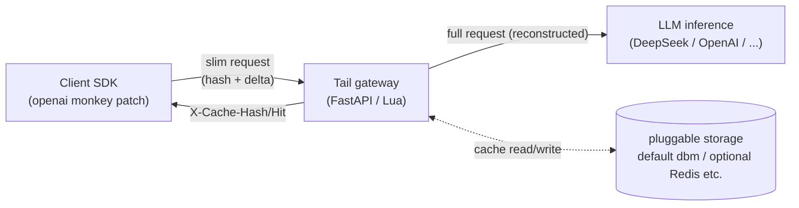

# Tail — Uplink Bandwidth Optimizer for LLM Gateways

> **Tail** — *Send the tail, the head is cached.*
>
> The name comes from `tail -f`: show only the newly appended lines. Tail applies
> the same mental model to LLM requests — the prefix (the head) is already cached at
> the gateway, so the client sends only the incremental turn (the tail),
> **transparently saving uplink bandwidth between the SDK and the LLM Gateway**.

## How much does it save?

Long-context models (DeepSeek-V3, Qwen3, Gemini — now supporting **128K~1M tokens**)
make multi-turn request bodies **95%+ repeated prefix**. Tail sends only the delta.

Using a **1M-token context** as an example (~4 bytes/token, mostly English):

| | Without Tail | With Tail |
|---|---|---|
| Single request body | ~4 MB (full messages) | ~2 KB (delta + hash) |
| 10-turn conversation uplink | ~40 MB | ~4 MB (first) + 9×2 KB ≈ **4 MB** |
| Saving | — | **~90%** |
| 1000 concurrent convs × 10 turns/day | ~40 GB/day uplink | ~4 GB/day uplink |

The longer the context and the more turns, the higher the ratio (in the limit a single
delta is ~0.05% — a **99.9%** saving). Especially valuable where **uplink is metered**:
on-prem → cloud LLM gateway, cross-border calls, mobile clients.

---

## How it works



1. **First request**: client sends full messages → gateway caches the prefix → returns `X-Cache-Hash`
2. **Subsequent**: SDK sends only the delta + hash → gateway reconstructs the full request → forwards
3. **Optimistic send + auto-fallback**: hash is always attached; on a miss the SDK auto-resends the full body (fully transparent to the caller)

**Transparency**:
- To the **caller**: zero change to openai SDK usage (one `openai_patch.install()` line)
- To the **backend**: receives a standard, complete OpenAI request — no awareness
- Supports **streaming (SSE)**: the gateway transparently relays streamed responses, no buffering

---

## Quick start (Python gateway)

### Install

```bash
pip install tail            # or: pip install -e . (this repo)
```

### Start the gateway (one line, zero-dependency dbm by default)

```bash
# Point the backend at any real inference service
python -m tail.gateway --backend https://api.deepseek.com --port 8765
```

Optional flags:
```bash
python -m tail.gateway --backend https://api.deepseek.com \
    --storage dbm \              # default, zero-dep (or: redis for external KV)
    --dbm-path ./tail_cache.dbm \
    --miss-mode fast_fail \      # on miss: fast_fail (412 retry) | passthrough
    --port 8765
```

### Client usage (zero change)

```python
from tail import openai_patch
openai_patch.install()        # install once

from openai import OpenAI
client = OpenAI(base_url="http://127.0.0.1:8765/v1", api_key="sk-...")

# Use it normally — the SDK maintains the prefix cache, sends only the delta,
# and falls back to a full resend automatically.
resp = client.chat.completions.create(
    model="deepseek-chat",
    messages=[{"role": "user", "content": "Hello"}],
)
# Streaming is transparently supported too
stream = client.chat.completions.create(
    model="deepseek-chat",
    messages=[...], stream=True,
)
```

---

## Directory layout

```
tail/                      # client + Python gateway (primary)
├── openai_patch.py        # ★ openai SDK monkey patch (digest check + session isolation + auto-retry)
└── gateway/               # ★ Python gateway (FastAPI)
    ├── app.py             # route (three phases: hit-reconstruct / transparent-forward / streaming SSE)
    ├── storage.py         # Storage abstract base + DbmStorage (zero-dep default) / pluggable
    ├── segment.py / merkle.py / hashing.py   # v2.1 algorithms (segment split + Merkle incremental chain)
    ├── protocol.py        # constants + GatewayConfig
    └── __main__.py        # CLI entry (python -m tail.gateway ...)

openresty/                 # (optional) OpenResty/Lua gateway; cache_key byte-identical & interchangeable with Python
├── conf/nginx.conf
└── lua/kvcache/

tests/                     # tests (Python gateway + patch unit + OpenResty e2e)
docs/
└── DESIGN-chunked-cache.md   # design doc (v2.1 Segment-Merkle + access-driven renewal)
run.sh                     # one-shot start/stop (used by the OpenResty build)
```

---

## Protocol (summary)

**Request** (Client → Gateway):

| Header | Meaning |
|--------|---------|
| `X-Cache-Hash` | Optional. The cache hash returned in the last response. |
| `X-Cache-Prefix-Length` | Optional. Number of prefix messages that hash covers. |

When the hash is present, `messages` may contain **only the delta**; the gateway reconstructs the full messages.

**Response** (Gateway → Client):

| Header | Meaning |
|--------|---------|
| `X-Cache-Hash` | The new hash for this prefix; the client should store it. |
| `X-Cache-Expire` | Cache expiry as a Unix timestamp (with ±jitter, anti-avalanche). |
| `X-Cache-Hit` | `true`/`false` — whether the gateway cache hit. |

---

## Compared to the OpenAI Responses API

OpenAI's [Responses API](https://developers.openai.com/api/docs/guides/conversation-state) (2025) also tackles "re-sending the prefix", but with a different approach. The two can be combined.

### Approach difference

| | OpenAI Responses API | Tail |
|---|---|---|
| **Where cached** | **OpenAI server-side** storage (`store=true`) | **Gateway + client** side (your own infra) |
| **Reuse mechanism** | `previous_response_id` chains to the last response | `X-Cache-Hash` negotiation + delta messages |
| **Vendor lock-in** | **OpenAI only** (response objects live on OpenAI's side) | **Vendor-neutral** (any OpenAI-compatible API: DeepSeek / Qwen / local vLLM etc.) |
| **Switching models** | ❌ breaks the chain (a prior response isn't available to other models) | ✅ no impact (cache isolated per model) |
| **Data ownership** | Retained by OpenAI for 30 days ([official policy](https://developers.openai.com/api/docs/guides/your-data)) | **Fully self-controlled** (delete anytime, private deployment) |
| **Billing** | Even with `previous_response_id`, **all historical input tokens are still billed as input** | Backend receives a complete request; billing unchanged |
| **Protocol** | Responses API (new protocol, code migration needed) | Chat Completions (**zero change**) |

### When to use which?

- **OpenAI-only and OK with 30-day server-side storage** → Responses API is enough, no Tail needed
- **Using DeepSeek / Qwen / local vLLM / multiple vendors** → Tail (Responses API doesn't support non-OpenAI)
- **Compliance requires self-controlled data (finance/healthcare/gov)** → Tail (cache in your own gateway, never touches a third party)
- **Want to save *uplink bandwidth* rather than *token billing*** → Tail works directly; Responses API saves bandwidth too but relies on server-side impl
- **The two stack**: use Tail to save uplink, and still use Responses API when the backend is OpenAI

### The essential difference

The Responses API is "**let the vendor hold the state**" — convenient, but vendor lock-in and data residency on the vendor's side.
Tail is "**hold the state yourself**" — an extra gateway layer, in exchange for self-control, vendor neutrality, and protocol compatibility.

---

## Key design

1. **v2.1 Segment-Merkle**: messages split into segments by LLM turn, three independent hashes (system/tools/messages), combined `cache_key = sys::tools::pfx`; appending a turn adds O(1) nodes; cross-conversation content-addressed reuse.
2. **Access-driven renewal**: a cache node read renews its TTL — active chains never expire, idle chains fade away.
3. **Storage abstraction**: a 7-method interface; default `DbmStorage` (stdlib dbm, zero-dep), pluggable Redis etc.
4. **SDK consistency**: prefix-digest verification (prevents silent errors on compact/edit/reorder) + multi-session context isolation + auto-fallback to full resend.
5. **Transparent streaming**: SSE relayed chunk-by-chunk, no buffering, `text/event-stream` preserved.
6. **Optimistic send + fast_fail**: hash always attached; on miss returns 412 and the SDK retries once (zero extra RTT).

See `docs/DESIGN-chunked-cache.md` for details.

---

## Tests

```bash
# Python gateway unit + e2e (incl. streaming SSE)
python3 -m pytest tests/test_gateway_py.py -v

# openai patch unit (pure Python)
python3 -m pytest tests/test_openai_patch.py -v
```

| Layer | Count | Coverage |
|-------|-------|----------|
| Python gateway | 27 | algo consistency / dbm roundtrip / ASGI e2e / **streaming SSE passthrough** / cache hit |
| openai patch | 18 | multi-turn delta / multi-model / compact fallback / multi-session isolation / retry |
| OpenResty e2e | 15 | three-segment storage / hit reconstruct / reload persistence / access-driven renewal / streaming |

---

## Two gateway implementations (interchangeable)

| | Python (primary) | OpenResty (optional) |
|---|---|---|
| Framework | FastAPI + uvicorn | OpenResty + Lua |
| Storage | dbm (zero-dep default) / Redis etc. | Kvrocks (on-disk) |
| Start | `python -m tail.gateway --backend URL` | `./run.sh start` (build OpenResty+Kvrocks first) |
| cache_key | **byte-identical** | **byte-identical** |

Both produce the exact same `X-Cache-Hash` (same messages → same `sys::tools::pfx`) and are interchangeable or coexistable. The Python build runs zero-dependency out of the box; the OpenResty build is higher-performance for heavy production traffic.

---

## License

MIT
