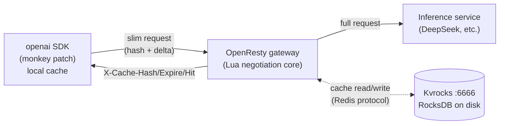

# Tail — Transport-Layer KV Cache Optimization

> **Tail** — *Send the tail, the head is cached.*
>
> The name comes from the `tail -f` command every developer knows: show only the
> newly appended lines. Tail applies the same mental model to LLM requests — the
> prefix (the head) is already cached at the gateway, so the client sends only the
> incremental turn (the tail), transparently saving uplink bandwidth.
>
> Corresponds to the design doc《传输层 KV Cache 优化系统设计文档 v1.0》. It inserts a
> prefix-cache negotiation layer between the client SDK and the API gateway. Using an
> **optimistic-send + auto-fallback** strategy, it transparently reduces the uplink
> payload of OpenAI Chat Completions requests, with **zero invasion** into the backend
> inference service.

Two components:
- **Client**: `tail/openai_patch.py` — a monkey patch for the official openai SDK (zero code change)
- **Server**: `openresty/lua/kvcache/` — an OpenResty/Lua gateway with Kvrocks (on-disk) cache

> 📖 中文文档见 [README.md](./README.md)。

---

## 1. Architecture (Production)



**Cache backend: Kvrocks only** (on-disk persistent). There is no in-process L1 layer —
by design the cache is a single backend. Kvrocks is RocksDB-based, so data **lands on disk**
and can store far more than memory; it speaks the Redis protocol, so the gateway connects
with `lua-resty-redis` / `redis-py`, with no extra dependencies.

OpenResty three phases (design doc §5.3):
- `access_by_lua`: synchronously read Kvrocks for hit/miss decision + rewrite request body (cosockets allowed here).
- `header_filter_by_lua`: inject `X-Cache-*` response headers (cosockets forbidden here).
- `log_by_lua`: write Kvrocks asynchronously via `ngx.timer.at` (cosockets forbidden here).

---

## 2. Directory layout

```
tail/                      # Client: openai SDK monkey patch
└── openai_patch.py        # ★ core: openai SDK monkey patch (digest check + session isolation + auto-retry)

openresty/                 # ★ Server: OpenResty/Lua gateway + Kvrocks on-disk cache (v2.1 Segment-Merkle)
├── conf/nginx.conf        # gateway config (access/header_filter/log phases wired to Lua)
├── conf/kvrocks.conf      # Kvrocks config (port 6666, data on disk)
├── lua/kvcache/
│   ├── hashing.lua        # hashing (string SHA256; exports encode_message/sha256_hex16)
│   ├── segment.lua        # ★ v2.1 segment splitting (m·n=0 constraint)
│   ├── merkle.lua         # ★ v2.1 Merkle prefix chain
│   ├── protocol.lua       # protocol header constants + anti-avalanche jitter + renew_ttl
│   ├── store.lua          # ★ v2.1 three-segment storage (sys/tools/seg/pfx/meta)
│   ├── gateway.lua        # negotiation core (access reconstruct / log write)
│   ├── *_spec.lua         # Lua unit tests (hashing/protocol/segment/merkle/store)
├── run_lua_tests.sh       # unified Lua test runner
└── logs/
runtime/                   # locally compiled runtime (gitignored; build it yourself)
├── openresty/             # OpenResty 1.27 + LuaJIT
└── kvrocks/bin/kvrocks    # Kvrocks 2.16.0
tests/                     # tests (patch unit tests + OpenResty e2e)
docs/
└── DESIGN-chunked-cache.md # v2.1 design doc (Segment-Merkle + SDK consistency)
run.sh                     # one-shot start/stop (Kvrocks + gateway + mock backend)
```

---

## 3. Protocol (summary)

**Request direction** (Client → Gateway), custom headers:

| Header                      | Meaning                                                  |
|-----------------------------|----------------------------------------------------------|
| `X-Cache-Hash`              | Optional. The cache hash returned in the last response.  |
| `X-Cache-Prefix-Length`     | Optional. Number of prefix messages that hash covers; helps the gateway validate. |

When the hash is present, the body's `messages` may contain **only the delta** (new turns);
the gateway reconstructs the full messages.

**Response direction** (Gateway → Client), custom headers:

| Header            | Meaning                                                          |
|-------------------|------------------------------------------------------------------|
| `X-Cache-Hash`    | The new hash for this prefix; the client should store it.        |
| `X-Cache-Expire`  | Cache expiry as a Unix timestamp (seconds, with ±jitter).        |
| `X-Cache-Hit`     | `true`/`false` — whether the gateway cache hit on this request.  |

---

## 4. Quick start

### 4.1 One-shot start

```bash
cd tail   # enter the project root after cloning
./run.sh start      # start Kvrocks (6666) + gateway (8765) + mock backend (8080)
./run.sh status     # show service status
./run.sh stop       # stop all
```

### 4.2 Using the official openai SDK (transparent, zero code change)

```python
from tail import openai_patch
openai_patch.install()        # install the monkey patch

from openai import OpenAI
client = OpenAI(base_url="http://127.0.0.1:8765/v1", api_key="sk-anything")

# Use it normally — the SDK maintains the prefix cache, sends only the delta,
# and falls back to a full resend automatically on miss.
client.chat.completions.create(
    model="deepseek-chat",
    messages=[{"role": "user", "content": "Hello"}],
)
```

### 4.3 Running tests

```bash
# Lua unit tests (only needs OpenResty)
./openresty/run_lua_tests.sh

# patch unit tests (pure Python, no services needed)
python3 -m pytest tests/test_openai_patch.py -v

# OpenResty e2e (requires ./run.sh start first: Kvrocks + gateway + backend)
python3 -m pytest tests/test_openresty_e2e.py -v
```

---

## 5. Key design decisions

1. **Single cache backend = Kvrocks (on-disk)**. No in-process L1 layer — by design the
   cache is unified on Kvrocks. Data lands on disk, survives process restarts, and can
   hold far more than RAM.
2. **Lua-side uses content-string hashing** instead of BPE token hashing. Integrating
   tiktoken into Lua is heavy; instead we SHA-256 the stable serialization of messages
   (length-prefixed encoding to prevent boundary collisions) — zero dependencies, fastest.
3. **OpenResty three-phase split**: `access` (sync read) / `header_filter` (inject headers) /
   `log` (timer async write) — working around the cosocket restrictions of each phase.
4. **Cache miss defaults to fast_fail**. With optimistic send, a miss means the client only
   sent the delta; forwarding that directly would give the backend an incomplete request.
   So the gateway returns 422 + `X-Cache-Hit: false`, and the SDK resends the full messages
   once (§6.4). `passthrough` mode is available as the doc-literal alternative.
5. **Anti-avalanche**: expiry timestamps carry ±jitter (§9).
6. **Graceful fallback**: any internal gateway error falls back to passthrough; if Kvrocks is
   unreachable, requests do not crash (§5.4).
7. **v2.1 Segment-Merkle**: messages are split by LLM turn into segments, with three
   independent hashes (sys/tools/pfx). The combined `cache_key = sys::tools::pfx`; appending
   one turn adds only O(1) nodes; cross-conversation content-addressed reuse.
8. **Access-driven renewal** (§7.4): each pfx node read renews its TTL — active chains never
   expire, idle chains fade away naturally.

---

## 6. Test results (118/118 passing)

### Lua unit tests (85)
```
hashing:   23/23   stability / anti-collision / boundary / prefix-growth / unicode / multimodal / long
protocol:  14/14   header constants / jittered expiry / defaults / renew_ttl
segment:   19/19   ★ v2.1 splitting: basic forms / m·n=0 / tool turns / streaming edge / flatten-match
merkle:    14/14   ★ v2.1 chain: segment_hash / chain_step / build_nodes / incremental advance
store:     15/15   ★ v2.1 three-segment: put_request / reconstruct / missing-segment / broken-chain / renewal
```

### Python tests (18)
```
test_openai_patch (18)    monkey patch + v2.1 SDK consistency (see below)
```

### monkey patch tests (18, incl. v2.1 SDK consistency)
```
basic: install idempotent / first full / second delta / cache update / auto-retry / multi-turn / multi-model
v2.1 fixes: ★ compact falls back to full / ★ edit-old-message falls back / ★ reorder falls back /
            ★ multi-session contextvars isolation / ★ serial session graceful fallback / digest replaces array
```

### OpenResty+Kvrocks e2e (15)
```
health / first full / hit reconstruct / miss fast_fail / multi-turn new hash /
Kvrocks actually stored / ★ access-driven TTL renewal / miss does not renew /
★ survives gateway reload (on-disk persistence) / large prefix /
wrong prefix_length / expired entry miss / concurrency / health endpoint
```

---

## 7. Build instructions (OpenResty + Kvrocks)

The `runtime/` directory is gitignored — anyone cloning must build both runtimes. See
`docs/DESIGN-chunked-cache.md` and the commit history for details.

### OpenResty
Compiled from source into `runtime/openresty/`, including LuaJIT 2.1, the resty CLI, and
the lua-resty-* libraries.

### Kvrocks
Compiled from source (v2.16.0). Three hurdles (all resolved in this repo):
- Uses the system `librocksdb.so` + headers (the sandbox network couldn't download the
  rocksdb source tarball); `cmake/rocksdb.cmake` was patched to use the system library.
- Patched jemalloc 5.3.1 for gcc 16 incompatibility (`std::__throw_bad_alloc`).
- Added a `zlib_with_headers` alias target (a linking requirement after the system-lib switch).

---

## 8. Component mapping (vs. the design doc)

| Component                     | Location                                           | Design doc |
|-------------------------------|----------------------------------------------------|------------|
| **Server gateway**            | `openresty/lua/kvcache/gateway.lua`                | §5.3       |
| └ access/header_filter/log    | nginx.conf three phases                            | §5.3       |
| **Server cache**              | `openresty/lua/kvcache/store.lua` (Kvrocks direct) | §5.1       |
| **Server hashing**            | `openresty/lua/kvcache/hashing.lua`                | §5.2       |
| **Client monkey patch**       | `tail/openai_patch.py` (transparent, zero-change)  | §6         |

---

## 9. Implemented / not implemented (vs. design doc phases)

- ✅ **Phase 1**: gateway, hashing, Kvrocks cache, body rewrite, unit + e2e tests.
- ✅ **Phase 2**: SDK cache management, auto-fallback retry, integration (openai SDK monkey patch).
- ✅ **Phase 3 (partial)**: Kvrocks on-disk cache (now the single backend); v2.1 Segment-Merkle;
  access-driven renewal. Layered chunking / monitoring / hash-legitimacy checks not included.
- ⏳ **Phase 4**: protocol documentation, Responses API interop not included.
