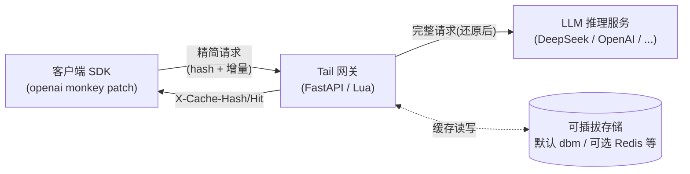

# Tail —— LLM 上行带宽优化网关

> **Tail** — *Send the tail, the head is cached.*
>
> 名字取自 `tail -f`:只看新增的几行。Tail 把同样的心智模型用到 LLM 请求上——
> 前缀(头部)已在网关缓存,客户端只发增量(尾部),**透明节省 SDK 与 LLM Gateway 之间的上行带宽**。

## 这能省多少?

长上下文模型(DeepSeek-V3、Qwen3、Gemini 等已支持 **128K~1M token**)下,多轮对话的请求体里 **95%+ 是重复的前缀**。Tail 只发增量,把它压到接近 0。

以 **1M token 上下文**为例(粗估 1 token ≈ 4 字节,英文为主):

| | 不用 Tail | 用 Tail |
|---|---|---|
| 单次请求体 | ~4 MB(完整 messages) | ~2 KB(增量 + hash) |
| 10 轮对话上行流量 | ~40 MB | ~4 MB(首次)+ 9×2 KB ≈ **4 MB** |
| 节省 | — | **~90%** |
| 1000 并发对话 × 日均 10 轮 | ~40 GB/天上行 | ~4 GB/天上行 |

实际节省取决于上下文长度与轮次:上下文越长、轮次越多,节省比例越高(极限情况单轮增量仅占 0.05%,节省 **99.9%**)。对**上行带宽计费敏感**的场景(企业内网→公有云 LLM Gateway、跨境调用、移动端)尤其显著。

---

## 工作原理



1. **首次请求**:客户端发完整 messages → 网关缓存前缀 → 返回 `X-Cache-Hash`
2. **后续请求**:SDK 自动只发增量 + hash → 网关按 hash 还原完整请求 → 转发后端
3. **乐观发送 + 自动降级**:默认带 hash,缓存未命中则 SDK 自动重发全量(对调用方完全透明)

**透明性**:
- 对**调用方**:openai SDK 用法零改动(`openai_patch.install()` 一行)
- 对**后端**:收到的是标准完整 OpenAI 请求,无感知
- 支持 **streaming(SSE)**:网关透明转发流式响应,边收边发不缓冲

---

## 快速开始(Python 版网关)

### 安装

```bash
pip install tail            # 或 pip install -e . (本仓库)
```

### 启动网关(一行命令,默认零依赖 dbm 存储)

```bash
# 后端指向真实推理服务即可
python -m tail.gateway --backend https://api.deepseek.com --port 8765
```

可选参数:
```bash
python -m tail.gateway --backend https://api.deepseek.com \
    --storage dbm \              # 默认,零依赖(也可 redis 连外部 KV)
    --dbm-path ./tail_cache.dbm \
    --miss-mode fast_fail \      # 未命中:fast_fail(422 重试)| passthrough
    --port 8765
```

### 客户端使用(零改动)

```python
from tail import openai_patch
openai_patch.install()        # 装一次

from openai import OpenAI
client = OpenAI(base_url="http://127.0.0.1:8765/v1", api_key="sk-...")

# 照常用,SDK 自动维护前缀缓存、只发增量、自动降级
resp = client.chat.completions.create(
    model="deepseek-chat",
    messages=[{"role": "user", "content": "Hello"}],
)
# 流式也透明支持
stream = client.chat.completions.create(
    model="deepseek-chat",
    messages=[...], stream=True,
)
```

---

## 目录结构

```
tail/                      # 客户端 + Python 网关(主)
├── openai_patch.py        # ★ openai SDK monkey patch(指纹校验 + session 隔离 + 自动重试)
└── gateway/               # ★ Python 网关(FastAPI)
    ├── app.py             # 路由(三阶段:命中还原/透明转发/streaming SSE)
    ├── storage.py         # Storage 抽象基类 + DbmStorage(零依赖默认)/ 可插拔
    ├── segment.py / merkle.py / hashing.py   # v2.1 算法(segment 切分 + Merkle 增量链)
    ├── protocol.py        # 常量 + GatewayConfig
    └── __main__.py        # 命令行入口(python -m tail.gateway ...)

openresty/                 # (可选)OpenResty/Lua 版网关,与 Python 版 cache_key 逐字节一致、可互换
├── conf/nginx.conf
└── lua/kvcache/           # hashing/segment/merkle/protocol/store/gateway

tests/                     # 测试(Python 网关 + patch 单测 + OpenResty 端到端)
docs/
└── DESIGN-chunked-cache.md   # 设计文档(v2.1 Segment-Merkle + 访问驱动续期)
run.sh                     # 一键启停(Kvrocks + 网关 + 模拟后端,OpenResty 版用)
```

---

## 协议(摘要)

**请求方向**(Client → Gateway):

| Header | 含义 |
|--------|------|
| `X-Cache-Hash` | 可选。上次响应返回的缓存哈希。 |
| `X-Cache-Prefix-Length` | 可选。该哈希对应的前缀消息条数。 |

携带哈希时,`messages` 可只含**增量**;网关负责还原完整 messages。

**响应方向**(Gateway → Client):

| Header | 含义 |
|--------|------|
| `X-Cache-Hash` | 本次前缀的新哈希,客户端应保存。 |
| `X-Cache-Expire` | 缓存过期 Unix 时间戳(带 ±jitter 防雪崩)。 |
| `X-Cache-Hit` | `true`/`false`,网关是否命中。 |

---

## 关键设计

1. **v2.1 Segment-Merkle**:messages 按 LLM 回合切 segment,三段独立 hash(system/tools/messages),组合 `cache_key = sys::tools::pfx`;加一段只增 O(1) 节点;跨对话内容寻址复用。
2. **访问驱动续期**:缓存节点读一次续一个 TTL,活跃对话链永不过期,沉寂对话自然消亡。
3. **Storage 抽象**:对齐 7 方法接口,默认 `DbmStorage`(标准库 dbm,零依赖),可插拔 Redis 等。
4. **SDK 一致性**:前缀指纹校验(防 compact/编辑/重排静默错误)+ 多 session 上下文隔离 + 自动降级全量重发。
5. **透明 streaming**:SSE 边收边发,不缓冲,`text/event-stream` 原样透传。
6. **乐观发送 + fast_fail**:默认带 hash,未命中返回 422 由 SDK 重试一次(零额外 RTT)。

详见 `docs/DESIGN-chunked-cache.md`。

---

## 测试

```bash
# Python 网关单测 + 端到端(含 streaming SSE)
python3 -m pytest tests/test_gateway_py.py -v

# openai patch 单测(纯 Python)
python3 -m pytest tests/test_openai_patch.py -v
```

| 层 | 数量 | 覆盖 |
|----|------|------|
| Python 网关 | 27 | 算法一致性 / dbm roundtrip / ASGI 端到端 / **streaming SSE 透传** / 缓存命中 |
| openai patch | 18 | 多轮增量 / 多模型 / compact 降级 / 多 session 隔离 / 重试 |
| OpenResty 端到端 | 15 | 三段存储 / 命中还原 / reload 持久 / 访问驱动续期 / streaming |

---

## 两个网关实现(可互换)

| | Python 版(主) | OpenResty 版(可选) |
|---|---|---|
| 框架 | FastAPI + uvicorn | OpenResty + Lua |
| 存储 | dbm(零依赖默认)/ Redis 等 | Kvrocks(硬盘) |
| 启动 | `python -m tail.gateway --backend URL` | `./run.sh start`(需编译 OpenResty+Kvrocks) |
| cache_key | **逐字节一致** | **逐字节一致** |

两者产出的 `X-Cache-Hash` 完全相同(同样的 messages → 同样的 `sys::tools::pfx`),可互换或共存。Python 版零依赖开箱即用;OpenResty 版性能更高(适合大流量生产)。

---

## License

MIT
