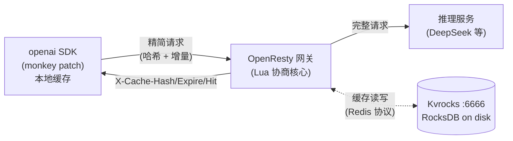

# Tail —— 传输层 KV Cache 优化系统

> 📖 English: [README.en.md](./README.en.md)
>
> **Tail** — *Send the tail, the head is cached.*
> **头部已缓存,只发尾部。**
>
> 名字取自每个开发者都熟悉的 `tail -f`:只看新增的几行。Tail 把同样的心智模型用到
> LLM 请求上——前缀(头部)已在网关缓存,客户端只发增量(尾部),透明节省上行带宽。
>
> 对应设计文档《传输层 KV Cache优化系统设计文档 v1.0》。在客户端 SDK 与 API 网关之间
> 引入前缀缓存协商层,以「乐观发送 + 自动降级」策略,透明节省 OpenAI Chat Completions
> 接口的公网上行带宽,对后端推理服务完全无侵。

两个组件:
- **客户端**:`tail/openai_patch.py` —— openai 官方 SDK 的 monkey patch(零改动)
- **服务端**:`openresty/lua/kvcache/` —— OpenResty/Lua 网关 + Kvrocks(硬盘)缓存

---

## 1. 架构(生产版)



**缓存后端:只用 Kvrocks**(硬盘持久化)。不再有进程内 L1 层——按需求精简为单一缓存后端:
Kvrocks 基于 RocksDB,数据**落硬盘**,可存储远超内存容量的前缀缓存;Redis 协议兼容,
网关用 `lua-resty-redis` / `redis-py` 连接,零额外依赖。

OpenResty 三阶段(对应设计文档第 5.3 节):
- `access_by_lua`:同步读 Kvrocks 判定命中 + 请求体改写(允许 cosocket)。
- `header_filter_by_lua`:注入 `X-Cache-*` 响应头(禁止 cosocket)。
- `log_by_lua`:用 `ngx.timer.at` 异步写 Kvrocks(此阶段禁止 cosocket)。

---

## 2. 目录结构

```
tail/                      # 客户端
└── openai_patch.py        # ★ openai 官方 SDK monkey patch(指纹校验 + session 隔离 + 自动重试)
openresty/                 # ★ 服务端:OpenResty/Lua 网关 + Kvrocks 硬盘缓存(v2.1 Segment-Merkle)
├── conf/nginx.conf        # 网关配置(access/header_filter/log 三阶段挂 Lua)
├── conf/kvrocks.conf      # Kvrocks 配置(端口 6666,数据落盘)
├── lua/kvcache/
│   ├── hashing.lua        # 哈希(字符串 SHA256,导出 encode_message/sha256_hex16)
│   ├── segment.lua        # ★ v2.1 segment 切分(m·n=0 约束)
│   ├── merkle.lua         # ★ v2.1 Merkle 前缀链
│   ├── protocol.lua       # 协议头常量 + 防雪崩抖动 + renew_ttl
│   ├── store.lua          # ★ v2.1 三段存储(sys/tools/seg/pfx/meta)
│   ├── gateway.lua        # 协商核心(access 三段还原 / log 三段写)
│   ├── *_spec.lua         # Lua 单测(hashing/protocol/segment/merkle/store)
├── run_lua_tests.sh       # 统一 Lua 单测 runner
└── logs/
runtime/                   # 本地编译的运行时(gitignore,需自己 build)
├── openresty/             # OpenResty 1.27 + LuaJIT
└── kvrocks/bin/kvrocks    # Kvrocks 2.16.0
tests/                     # 测试(patch 单测 + OpenResty 端到端)
docs/
└── DESIGN-chunked-cache.md # v2.1 设计文档(分层 Segment-Merkle + SDK 一致性)
run.sh                     # 一键启停(Kvrocks + 网关 + 模拟后端)
```

---

## 3. 协议(摘要)

**请求方向**(Client → Gateway):

| Header                      | 含义                                          |
|-----------------------------|-----------------------------------------------|
| `X-Cache-Hash`              | 可选。上次响应里的缓存哈希。                   |
| `X-Cache-Prefix-Length`     | 可选。该哈希对应的前缀消息条数,辅助网关校验。 |

携带哈希时,Body 的 `messages` 可只含**增量**(新增轮次);网关负责还原完整 messages。

**响应方向**(Gateway → Client):

| Header            | 含义                                            |
|-------------------|-------------------------------------------------|
| `X-Cache-Hash`    | 本次前缀的新哈希,客户端应保存。                 |
| `X-Cache-Expire`  | 缓存过期 Unix 时间戳(秒,带 ±jitter 防雪崩)。 |
| `X-Cache-Hit`     | `true`/`false`,网关层是否命中。                 |

---

## 4. 快速开始

### 4.1 一键启动

```bash
cd tail   # clone 后进入项目根
./run.sh start      # 起 Kvrocks(6666)+ 网关(8765)+ 模拟后端(8080)
./run.sh status     # 查看各服务状态
./run.sh stop       # 停全部
```

### 4.2 用 openai 官方 SDK(透明,代码零改动)

```python
from tail import openai_patch
openai_patch.install()        # 装 monkey patch

from openai import OpenAI
client = OpenAI(base_url="http://127.0.0.1:8765/v1", api_key="sk-anything")

# 照常用,SDK 自动维护前缀缓存、只发增量、自动降级重试
client.chat.completions.create(
    model="deepseek-chat",
    messages=[{"role": "user", "content": "Hello"}],
)
```

### 4.3 跑测试

```bash
# Lua 单测(只需 OpenResty)
./openresty/run_lua_tests.sh

# patch 单测(纯 Python,无需服务)
python3 -m pytest tests/test_openai_patch.py -v

# OpenResty 端到端(需先 ./run.sh start 起 Kvrocks+网关+后端)
python3 -m pytest tests/test_openresty_e2e.py -v
```

---

## 5. 关键设计决策

1. **唯一缓存后端 = Kvrocks(硬盘)**:去掉进程内 L1 层,统一用 Kvrocks。
   数据落硬盘,可存远超内存量;进程重启缓存不丢(reload 后仍命中)。
2. **Lua 侧用 content 字符串哈希**:Lua 集成 tiktoken 成本高,用 messages 序列化字符串的
   SHA256(定长编码防边界碰撞),零依赖、最快。
3. **OpenResty 三阶段分工**:`access`(同步读)/`header_filter`(注入头)/`log`(timer 异步写),
   规避各阶段的 cosocket 限制。
4. **缓存未命中默认 fast_fail**:乐观发送下未命中时客户端只发了增量,直接转发会给后端残缺请求;
   默认返回 422 + `X-Cache-Hit: false`,SDK 用完整 messages 重试一次(第 6.4 节)。
5. **防雪崩**:过期时间带 ±jitter(第 9 章)。
6. **降级容错**:网关任何内部异常 fallback 到透传;Kvrocks 不可用时请求不崩(第 5.4 节)。
7. **v2.1 Segment-Merkle**:messages 按 LLM 回合切 segment,三段独立 hash(sys/tools/pfx),
   组合 cache_key = `sys::tools::pfx`;加一段只增 O(1) 节点;跨对话内容寻址复用。
8. **访问驱动续期**(§7.4):pfx 节点读一次续一个 TTL,活跃链永不过期,沉寂链自然消亡。

---

## 6. 测试结果(118/118 全过)

### Lua 单元测试(85)
```
hashing:   23/23   稳定性/抗碰撞/边界/前缀扩展/特殊字符/多模态/超长
protocol:  14/14   头部常量/抖动过期/默认配置/renew_ttl
segment:   19/19   ★ v2.1 切分:基础形态/m·n=0/工具回合/streaming 边缘/展平一致
merkle:    14/14   ★ v2.1 链:segment_hash/chain_step/build_nodes/增量推进
store:     15/15   ★ v2.1 三段:put_request/reconstruct/缺失段/链断裂/续期
```

### Python 测试(18)
```
test_openai_patch (18)    monkey patch + v2.1 SDK 一致性(见下)
```

### monkey patch 测试(18,含 v2.1 SDK 一致性)
```
基础:install 幂等 / 首次全量 / 二次增量 / 缓存更新 / 自动重试 / 多轮 / 多模型
v2.1 修复:★ compact 降级全量 / ★ 编辑旧消息降级 / ★ 重排降级 /
          ★ 多 session contextvars 隔离 / ★ 串行 session 优雅降级 / digest 替代数组
```

### OpenResty+Kvrocks 端到端(15)
```
health / 首次全量 / 命中还原 / miss fast_fail / 多轮新哈希 /
Kvrocks 真写入 / ★ 访问驱动续期(读后 TTL 刷新) / miss 不续期 /
★ reload 后仍命中(硬盘持久) / 大前缀 /
错误 prefix_length / 过期 entry miss / 并发 / 健康端点
```

---

## 7. 编译说明(OpenResty + Kvrocks)

### OpenResty
源码编译到 `runtime/openresty/`,含 LuaJIT 2.1、resty CLI、lua-resty-* 库。

### Kvrocks
源码编译 v2.16.0。三个坎(均已解决):
- 用系统 `librocksdb.so` + 头文件(沙箱网络无法下载 rocksdb 源码),
  改造 `cmake/rocksdb.cmake` 走系统库。
- patch jemalloc 5.3.1 与 gcc 16 的不兼容(`std::__throw_bad_alloc`)。
- 补 `zlib_with_headers` 别名 target(系统库改造后的链接需求)。

---

## 8. 组件对应关系(对照设计文档)

| 组件                          | 位置                                                | 设计文档章节 |
|-------------------------------|-----------------------------------------------------|--------------|
| **服务端 网关**               | `openresty/lua/kvcache/gateway.lua`                 | 第 5.3 节    |
| └ access/header_filter/log    | nginx.conf 三阶段                                   | 第 5.3 节    |
| **服务端 缓存**               | `openresty/lua/kvcache/store.lua`(直连 Kvrocks)   | 第 5.1 节    |
| **服务端 哈希**               | `openresty/lua/kvcache/hashing.lua`                 | 第 5.2 节    |
| **客户端 monkey patch**       | `tail/openai_patch.py`(透明,零改动)              | 第 6 章      |

---

## 9. 已实现 / 未实现(对照设计文档 Phase)

- ✅ **Phase 1**:网关、哈希、Kvrocks 缓存、Body 改写、单元/端到端测试。
- ✅ **Phase 2**:SDK 缓存管理、自动降级重试、链路联调(openai 官方 SDK monkey patch)。
- ✅ **Phase 3(部分)**:Kvrocks 硬盘缓存(现已作为唯一后端);分层 Chunking / 监控告警未含。
- ⏳ **Phase 4**:协议文档化、Responses API 互操作未含。
